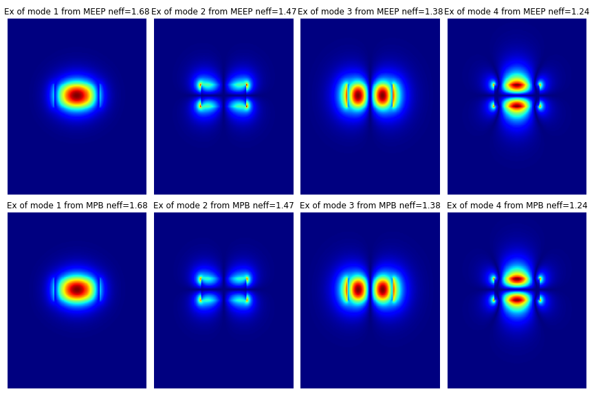
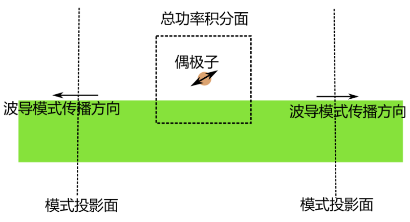
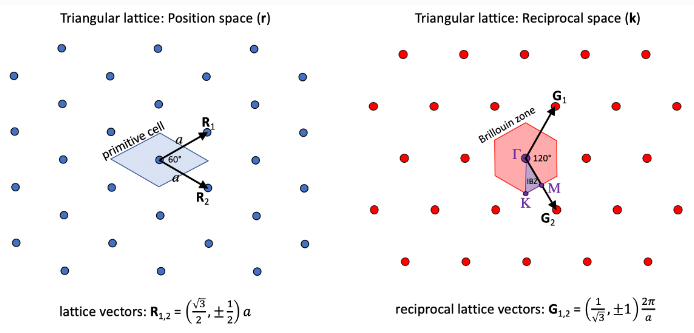
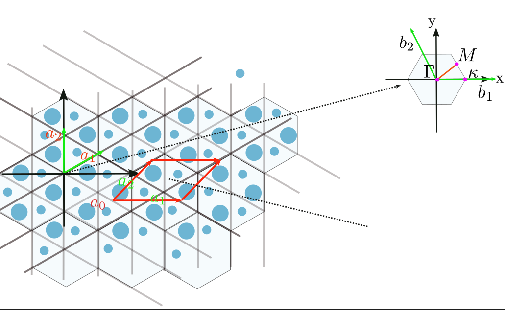
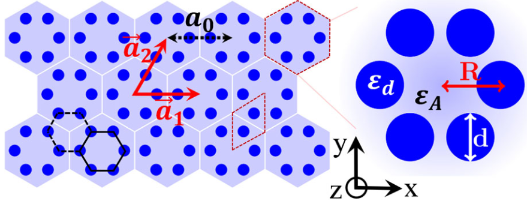
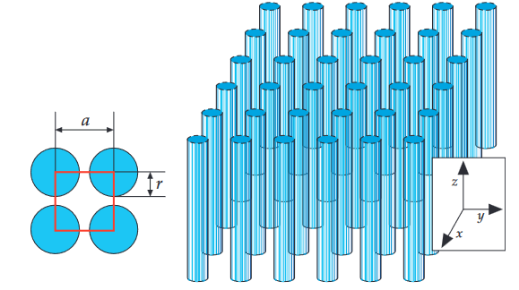
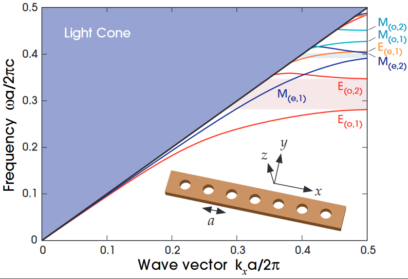
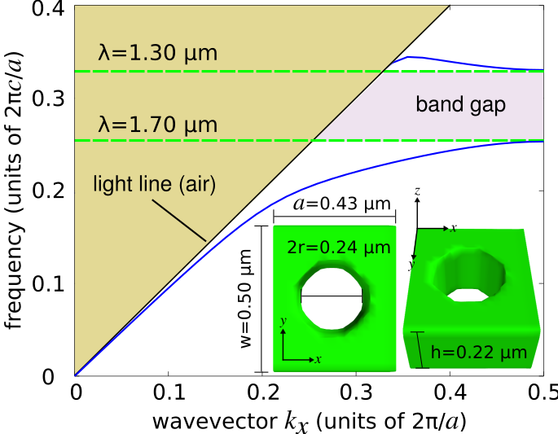
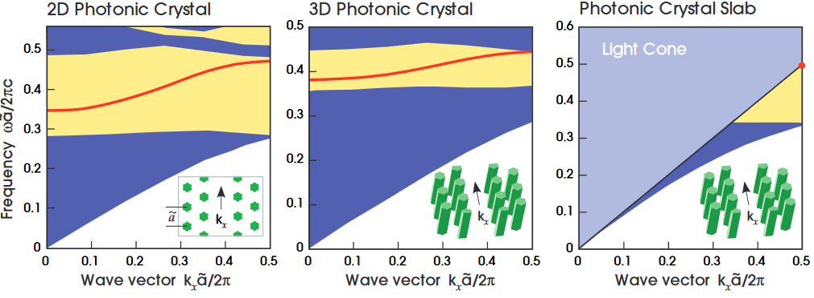

# MEEP Study
There will be notes and programs about the use of MEEP to do simulations.

# The eigenmode simulations

* The Blog:  [Meep教程(2):Meep和MPB分别计算光波导模式教程](https://knifelees3.github.io/2021/07/11/C_%E6%95%99%E7%A8%8B_%E7%94%A8Meep%E5%92%8CMPB%E8%AE%A1%E7%AE%97%E5%85%89%E6%B3%A2%E5%AF%BC%E6%A8%A1%E5%BC%8F/) 
* The notebook: [Simulating the waveguide mode](https://github.com/knifelees3/MEEPStudy/blob/master/WaveguideModeSimulations.ipynb)

# Dipole guide coupling

* The Blog: [Dipole Guide Coupling Simulations](https://knifelees3.github.io/2021/07/11/C_%E6%95%99%E7%A8%8B_%E7%94%A8Meep%E8%AE%A1%E7%AE%97%E5%81%B6%E6%9E%81%E5%AD%90%E8%80%A6%E5%90%88%E5%88%B0%E5%85%89%E6%B3%A2%E5%AF%BC%E6%A8%A1%E5%BC%8F%E7%9A%84%E6%95%88%E7%8E%87/)
* The program [DipoleEmissionNearWaveguide_SweepDipoleHeight.py](https://github.com/knifelees3/MEEPStudy/blob/master/DipoleEmissionNearWaveguide_SweepDipoleHeight.py)

# Band structures simulations

## 2D Triangle Periodic Structures

Files: [MPBBand_2DTriRod.ipynb](https://github.com/knifelees3/MEEPStudy/blob/master/MPBBand_2DTriRod.ipynb)

## 2D Triangle Periodic Structure Topological

Files: [MPBBand_2DTriRod-Topological.ipynb](https://github.com/knifelees3/MEEPStudy/blob/master/MPBBand_2DTriRod-Topological.ipynb)

## 2D HoneyCombTopological Structure 

Files: [MPBBand_2DTriRod-Topological.ipynb](https://github.com/knifelees3/MEEPStudy/blob/master/MPBBand_2DHoneyCombTopologicalRealization.ipynb)

## 2D Orthogonal Rods

Files: [MPBBand_2D-OrthogonalRods.ipynb](https://github.com/knifelees3/MEEPStudy/blob/master/MPBBand_2D-OrthogonalRods.ipynb)

## 2D Nano Beam I

Files: [MPBBand_Book_NanoBeam.ipynb](https://github.com/knifelees3/MEEPStudy/blob/master/MPBBand_Book_NanoBeam.ipynb)

## 2D Nano Beam II

Files: [MPBBand_NanoBeam.ipynb](https://github.com/knifelees3/MEEPStudy/blob/master/MPBBand_NanoBeam.ipynb)

## 2D Line Defects

Files: [MPBBand-LineDefects.ipynb](https://github.com/knifelees3/MEEPStudy/blob/master/MPBBand-LineDefects.ipynb)

